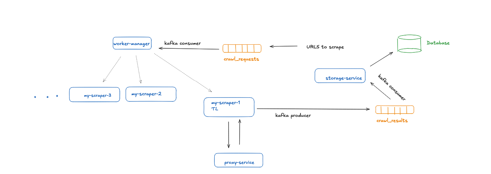

# ScrapeNinja
A high-performance, scalable web scraper using Scrapy, Kafka, and Redis, with advanced **anti-bot evasion** and a **microservices architecture** for seamless data extraction at scale.  

## Features  
**Distributed Scraping** with Scrapy + Kafka + Redis  
**Anti-Bot Evasion** (Fingerprint Spoofing, Proxy Rotation)  
**Scalable Storage** (PostgreSQL)  
**Microservices Architecture** (Proxy Service, Scraper, Storage API)  

---

## Architecture  

